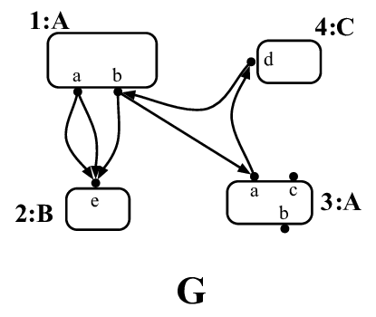

<a name="readme-top"></a>

[![Contributors][contributors-shield]][contributors-url]
[![Forks][forks-shield]][forks-url]
[![Stargazers][stars-shield]][stars-url]
[![Issues][issues-shield]][issues-url]
[![MIT License][license-shield]][license-url]


<!-- PROJECT LOGO -->
<br />
<div align="center">
  <a href="https://github.com/kierannp/molGrouper">
    
  </a>

<h3 align="center">molGrouper</h3>

  <p align="center">
    A software package for creating and manipulating graphs of molecular groups.
    <br />
    <a href="https://github.com/kierannp/molGrouper"><strong>Explore the docs »</strong></a>
    <br />
    <br />
    <a href="https://github.com/kierannp/molGrouper">View Demo</a>
    ·
    <a href="https://github.com/kierannp/molGrouper/issues">Report Bug</a>
    ·
    <a href="https://github.com/kierannp/molGrouper/issues">Request Feature</a>
  </p>
</div>


<!-- TABLE OF CONTENTS -->
<details>
  <summary>Table of Contents</summary>
  <ol>
    <li>
      <a href="#about-the-project">About The Project</a>
      <ul>
        <li><a href="#built-with">Built With</a></li>
      </ul>
    </li>
    <li>
      <a href="#getting-started">Getting Started</a>
      <ul>
        <li><a href="#prerequisites">Prerequisites</a></li>
        <li><a href="#installation">Installation</a></li>
      </ul>
    </li>
    <li><a href="#usage">Usage</a></li>
    <li><a href="#roadmap">Roadmap</a></li>
    <li><a href="#contributing">Contributing</a></li>
    <li><a href="#license">License</a></li>
    <li><a href="#contact">Contact</a></li>
    <li><a href="#acknowledgments">Acknowledgments</a></li>
  </ol>
</details>


<!-- ABOUT THE PROJECT -->
## About The Project

The fundamental data structure behind this package is based on a port graph, look [here](https://doi.org/10.1017/S0960129518000270) for an excellent description of the data structure.

<p align="right">(<a href="#readme-top">back to top</a>)</p>

### Portgraph
<br />
<div align="center">
  <a href="https://github.com/kierannp/molGrouper">
    
  </a>
</div>


<!-- GETTING STARTED -->
## Getting Started

### Installation

1. Clone the repo
```sh
git clone https://github.com/kierannp/molGrouper
cd molGrouper
```
2. Install with pip
```python
pip install .
```

<p align="right">(<a href="#readme-top">back to top</a>)</p>


<!-- USAGE EXAMPLES -->
## Usage

### Group graph initalization
```python
node_types = {
    'type1': ['port1', 'port2'],
    'type2': ['port3', 'port4'],
}


gG = GroupGraph(node_types)
gG.add_node('node1', 'type1')
gG.add_node('node2', 'type1')
gG.add_node('node3', 'type2')

gG.add_edge('node1', 'port1', 'node2', 'port1')
```
### Group graph from mBuild.Compound
```python
import mbuild as mb
from group_selfies import Group
from molGrouper import GroupGraph

mol = mb.load('CCCCCCCC', smiles=True) # octane molecule
groups = [Group('c3', 'C([H])([H])([H])(*1)'), Group('c2', 'C([H])([H])(*1)(*1)')]
gG = GroupGraph()
gG = gG.from_compound(mol, groups)
```
### Conversion to torch_geometric.Data
```python
import molGrouper

node_types = {
    'CH2': ['C1', 'C2'], #methylene
    'CONH': ['C', 'N'], #amide
}

gG = molGrouper.GroupGraph(node_types)
gG.add_node('node1', 'CH2')
gG.add_node('node2', 'CONH')
gG.add_edge('node1', 'C1', 'node2', 'C')

group_featurizer = lambda node: torch.tensor([1, 0]) # dummy group featurizer

data = gG.to_data(group_featurizer, max_n_attachments=2)

data
# Data(x=[2,2], edge_index=[2,1], edge_attr=[1,4])
```


<p align="right">(<a href="#readme-top">back to top</a>)</p>

<!-- ROADMAP -->
## Roadmap
[ ] Generate possible graphs with attachments points as limiter for number of connections 

[ ] Process output of generation into python data structure

[ ] Substiute nodes based on max attachments for graphs

[ ] Verify structures with synthesizability checks

<!-- CONTRIBUTING -->
## Contributing

Contributions are what make the open source community such an amazing place to learn, inspire, and create. Any contributions you make are **greatly appreciated**.

If you have a suggestion that would make this better, please fork the repo and create a pull request. You can also simply open an issue with the tag "enhancement".
Don't forget to give the project a star! Thanks again!

1. Fork the Project
2. Create your Feature Branch (`git checkout -b feature/AmazingFeature`)
3. Commit your Changes (`git commit -m 'Add some AmazingFeature'`)
4. Push to the Branch (`git push origin feature/AmazingFeature`)
5. Open a Pull Request

<p align="right">(<a href="#readme-top">back to top</a>)</p>


<!-- LICENSE -->
## License

Distributed under the MIT License. See `LICENSE.txt` for more information.

<p align="right">(<a href="#readme-top">back to top</a>)</p>


<!-- CONTACT -->
## Contact

Kieran Nehil-Puleo - nehilkieran@gmail.com

Project Link: [https://github.com/kierannp/molGrouper](https://github.com/kierannp/molGrouper)

<p align="right">(<a href="#readme-top">back to top</a>)</p>


<!-- ACKNOWLEDGMENTS -->
## Acknowledgments

* Cal Craven
* NSF GRFP

<p align="right">(<a href="#readme-top">back to top</a>)</p>


<!-- MARKDOWN LINKS & IMAGES -->
<!-- https://www.markdownguide.org/basic-syntax/#reference-style-links -->
[contributors-shield]: https://img.shields.io/github/contributors/kierannp/molGrouper.svg?style=for-the-badge
[contributors-url]: https://github.com/kierannp/molGrouper/graphs/contributors
[forks-shield]: https://img.shields.io/github/forks/kierannp/molGrouper.svg?style=for-the-badge
[forks-url]: https://github.com/kierannp/molGrouper/network/members
[stars-shield]: https://img.shields.io/github/stars/kierannp/molGrouper.svg?style=for-the-badge
[stars-url]: https://github.com/kierannp/molGrouper/stargazers
[issues-shield]: https://img.shields.io/github/issues/kierannp/molGrouper.svg?style=for-the-badge
[issues-url]: https://github.com/kierannp/molGrouper/issues
[license-shield]: https://img.shields.io/github/license/kierannp/molGrouper.svg?style=for-the-badge
[license-url]: https://github.com/kierannp/molGrouper/blob/master/LICENSE.txt